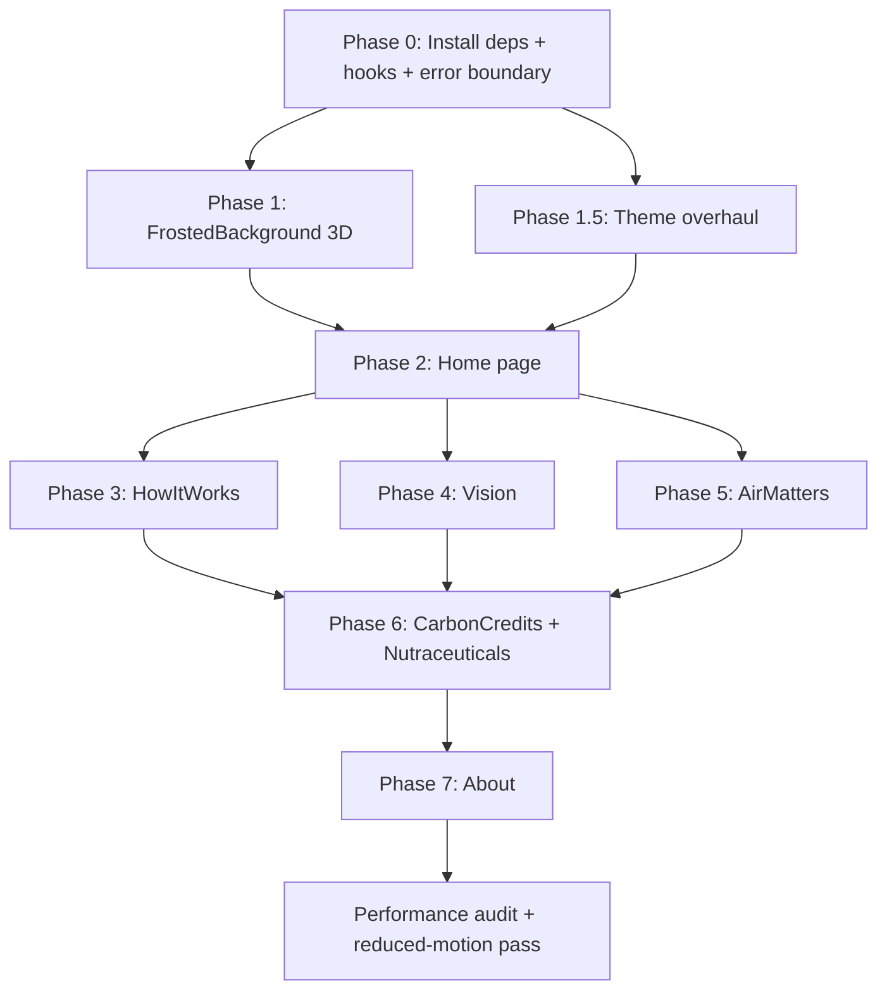

# Air Matters — 3D + UI Overhaul Implementation Plan

## Overview

A phased overhaul of the Air Matters React/TypeScript + Tailwind/Framer Motion website to add world-class 3D WebGL scenes (via `@react-three/fiber`) and a complete visual redesign. **The Home / landing page is the flagship surface — it must be the most immersive, best-looking page in the entire site and is the highest execution priority alongside the global theme refresh.**

The aesthetic direction: **high-tech bio-precision** — retain the green brand identity but make it sharper, bolder, and more data-rich. Glassmorphism stays but becomes more defined. Typography becomes more assertive.

---

## ⚠️ User Review Required

> [!NOTE]
> **✅ Theme Direction — RESOLVED**: Confirmed green brand palette. Core brand greens `#142c16 → #23572a → #2c7d3b → #56b452 → #ffffff` are the foundation. Architect extensions fill the system gaps. See Phase 1.5 for the full system.

> [!IMPORTANT]
> **No GLTF Models Exist**: Phases 2A, 3A reference `/models/bioreactor.glb`. This file does not exist in the repo. I will build a **procedural placeholder bioreactor** (cylinder + torus rings + cone cap) that renders correctly in the scene. **You must provide or commission the real GLTF** — swapping it in is a single import change once ready.

> [!WARNING]
> **Font Loading**: `JetBrains Mono` will be added for all data readouts (AQI, μg/m³, stats). `Space Grotesk` is already loaded. Both require a Google Fonts `<link>` in `client/index.html`.

> [!CAUTION]
> **GPU Budget**: Global Stars field + page-specific scenes + bloom across multiple pages may exceed 60fps on integrated graphics. `frameloop="demand"` is enforced on all non-hero canvases. `useReducedMotion` hook pauses all animation when the OS accessibility flag is set.

---

## Architect Additions (My Own Input)

These are enhancements I'm adding beyond the spec to make the implementation production-quality:

### ADD-1: `useThemeSync` hook
A dedicated hook (`client/src/hooks/use-theme-sync.ts`) that reads CSS custom properties once per render using `getComputedStyle` and returns a typed color object. All 3D components consume this instead of calling `getComputedStyle` independently each frame — shared memo, single read per re-render.

### ADD-2: `useReducedMotion` guard (global)
A `useReducedMotion` hook wrapping the native `prefers-reduced-motion` media query. Every Canvas receives a `paused` prop derived from this. When `paused=true`: clock stops, autoRotate disables, GLSL time uniform freezes at last value. This is a WCAG 2.1 requirement.

### ADD-3: `CanvasErrorBoundary.tsx`
A React Error Boundary specifically wrapping every `<Canvas>` — if WebGL context creation fails (e.g., some mobile browsers, privacy modes), it falls back to the existing CSS/framer-motion version of the component seamlessly without a white screen.

### ADD-4: Placeholder Bioreactor Geometry
Since no GLTF is available, I'll build a **procedural placeholder bioreactor** in Three.js: a CylinderGeometry body + TorusGeometry rings + ConeGeometry cap, grouped and positioned to mimic the existing CSS `BioReactor.tsx` visually. This placeholder is swappable via a single import when the real GLTF arrives.

### ADD-5: `PageWrapper` animation improvement
Rather than a simple opacity fade, I'll implement a **staggered child reveal** pattern: the `PageWrapper` uses `motion.div` with `variants` that cascade to child elements via `staggerChildren`. This makes page transitions feel intentional, not just a crossfade.

### ADD-6: AQI → 3D particle color pipeline
The `AQIParticles` component will read the **live AQI data from TanStack Query cache** (already fetched in `AirQualitySection`) via `useQueryClient().getQueryData()` rather than accepting a raw prop — this ensures realtime sync without prop-drilling and avoids double-fetching.

### ADD-7: 3D scene `dispose()` registry
A `useSceneDispose` hook that collects all geometries, materials, and textures on mount and disposes them on unmount using a `useEffect` cleanup — prevents WebGL context memory leaks on page navigation (which wouter does not handle automatically for Canvas).

### ADD-8: `InteractiveProductScrub` — Hybrid approach
Replacing the video scrub with a 3D model viewer is high-risk if the GLTF isn't ready. My approach: keep the existing video player intact as default, and render the 3D viewer **alongside** it (controlled by a toggle button). This preserves the current user experience while the 3D feature is validated.

---

## Proposed Changes

### Phase 0 — Dependencies & Infrastructure

#### [MODIFY] `package.json`
- Add: `three`, `@react-three/fiber`, `@react-three/drei`, `@react-three/postprocessing`, `leva`
- Add dev: `@types/three`

#### [NEW] `client/src/hooks/use-theme-sync.ts` (ADD-1)
Reads and memoizes CSS vars each frame via a `useRef` + `useFrame` compatible pattern.

#### [NEW] `client/src/hooks/use-reduced-motion.ts` (ADD-2)
Wraps `window.matchMedia('(prefers-reduced-motion: reduce)')` with a listener.

#### [NEW] `client/src/components/CanvasErrorBoundary.tsx` (ADD-3)
Class-based React Error Boundary with CSS fallback slot.

#### [NEW] `client/src/components/3d/PlaceholderBioreactor.tsx` (ADD-4)
Procedural Three.js geometry approximating the bioreactor form.

#### [NEW] `client/src/hooks/use-scene-dispose.ts` (ADD-7)
Cleanup registry for WebGL resources.

---

### Phase 1 — Global Foundation

#### [MODIFY] `client/src/components/FrostedBackground.tsx`
- Replace 3 CSS blob divs with a `<Canvas>` (fixed, inset-0, z-index -5, pointer-events-none)
- Scene: `<Stars count={3000} radius={120} depth={60} fade speed={0.3} />`
- Add slow-rotating torus-knot with `MeshDistortMaterial` (opacity 0.08, distort 0.4, speed 1.2)
- `useThemeSync` hook for fog/particle color polled via `useFrame`
- Keep existing blob divs as CSS fallback **inside** `<CanvasErrorBoundary>` fallback slot
- `frameloop="always"` (this is the ambient background)
- `useReducedMotion` → pause clock when true

#### [MODIFY] `client/src/App.tsx`
- Wrap `<Router>` output in `<AnimatePresence mode="wait">`
- **ADD-5**: `PageWrapper` with staggered child variants (opacity + translateY 12px, 0.4s enter / 0.2s exit)
- Apply `<PageWrapper>` to every route component

---

### Phase 1.5 — UI/UX Theme Overhaul

#### [MODIFY] `client/src/index.css` + `tailwind.config.ts`

**✅ Confirmed Brand Palette** (user-specified hex values + architect extensions):

#### Core Brand Greens (User-defined)
| Token | Hex | HSL | Usage |
|---|---|---|---|
| `--moss-deep` | `#142c16` | `hsl(124 36% 13%)` | Darkest green — dark mode backgrounds, true-black substitute |
| `--forest-dark` | `#23572a` | `hsl(128 42% 24%)` | Deep forest — dark mode cards, section accents |
| `--leaf` | `#2c7d3b` | `hsl(131 48% 33%)` | Leaf green — secondary interactive, borders on dark |
| `--bio-vibrant` | `#56b452` | `hsl(118 41% 51%)` | **Primary accent** — CTAs, active states, glows |
| `--oxygen-white` | `#ffffff` | `hsl(0 0% 100%)` | Pure white — light mode base, text on dark |

#### Architect Extensions (filling the system gaps)
| Token | Hex | HSL | Usage |
|---|---|---|---|
| `--void` | `#080f09` | `hsl(126 37% 5%)` | Near-black for true dark mode body (deeper than `--moss-deep`) |
| `--canopy` | `#1a3d1d` | `hsl(126 40% 17%)` | Mid-dark surface — between `--moss-deep` and `--forest-dark` |
| `--sprout` | `#3a9e46` | `hsl(127 45% 42%)` | Mid-vibrant — hover state of `--leaf`, progress fills |
| `--pulse` | `#7dd87a` | `hsl(118 54% 66%)` | Bright glow — 3D bloom color, active indicators, neon highlights |
| `--mist` | `#b8e8b6` | `hsl(118 44% 81%)` | Soft mint — light mode borders, subtle tints |
| `--ghost-mint` | `#f2faf2` | `hsl(120 40% 96%)` | Ultra-light — light mode page background |
| `--data-ink` | `#4a6040` | `hsl(100 18% 32%)` | Muted green-gray for body text / secondary labels (replaces zinc) |
| `--signal-amber` | `#f59e0b` | `hsl(38 92% 50%)` | Warning / moderate AQI states (only non-green accent, used sparingly) |
| `--hazard-red` | `#ef4444` | `hsl(0 84% 60%)` | Error / hazardous AQI (existing, confirmed to keep) |

#### Full CSS Variable Mapping

**Light Mode** (`:root`):
```css
--background:       hsl(120 40% 96%);   /* --ghost-mint */
--foreground:       hsl(124 36% 13%);   /* --moss-deep  */
--card:             hsl(118 44% 81% / 0.35); /* --mist tinted */
--card-border:      hsl(118 44% 81%);   /* --mist */
--primary:          hsl(118 41% 51%);   /* --bio-vibrant */
--primary-foreground: hsl(0 0% 100%);  /* white */
--secondary:        hsl(131 48% 33%);   /* --leaf */
--muted:            hsl(120 20% 93%);
--muted-foreground: hsl(100 18% 32%);  /* --data-ink */
--border:           hsl(118 44% 81%);   /* --mist */
--ring:             hsl(127 45% 42%);   /* --sprout */
--accent-glow:      hsl(118 54% 66%);   /* --pulse — for 3D bloom */
```

**Dark Mode** (`.dark`):
```css
--background:       hsl(126 37% 5%);    /* --void */
--foreground:       hsl(0 0% 100%);     /* white */
--card:             hsl(124 36% 13% / 0.65); /* --moss-deep semi */
--card-border:      hsl(131 48% 33% / 0.4);  /* --leaf faint */
--primary:          hsl(118 41% 51%);   /* --bio-vibrant (unchanged) */
--secondary:        hsl(128 42% 24%);   /* --forest-dark */
--muted:            hsl(126 40% 17% / 0.8);  /* --canopy */
--muted-foreground: hsl(118 44% 81% / 0.6);  /* --mist muted */
--border:           hsl(131 48% 33% / 0.45); /* --leaf faint */
--ring:             hsl(118 41% 51%);   /* --bio-vibrant */
--accent-glow:      hsl(118 54% 66%);   /* --pulse — brighter in dark */
```

**Typography** (`client/index.html`):
- `Space Grotesk` (already configured as `--font-display`) — headings h1–h6, bold/black weights
- Add: `JetBrains Mono:wght@400;700` → `--font-mono` — all data readouts (AQI numbers, μg/m³, stats, chart axes)
- Body (`--font-sans`): `Inter` unchanged

**Card redesign** (squircle standard):
- Normalize all cards to `rounded-[2rem]` border-radius
- Hover states: `border-[--bio-vibrant]/60` with `transition-colors duration-150` (snappy, not slow fade)
- Dark mode cards: `border-[--leaf]/30` → `border-[--sprout]/60` on hover
- Remove all generic `zinc-*` color references — replace with `--data-ink` / `--mist` tokens

**Navbar**:
- Scrolled state: `border-b border-[--leaf]/40` (replaces box-shadow)
- Active nav links: `text-[--bio-vibrant]` with `bg-[--bio-vibrant]/8` pill
- Theme toggle: tactile pill animation using `--sprout` fill

**3D scene colors derived from this palette**:
- `Stars` color: `--pulse` (`#7dd87a`) in dark, `--bio-vibrant` in light
- Fog: `--void` in dark, `--ghost-mint` in light
- Torus-knot: `--bio-vibrant` at opacity 0.08
- Bloom glow: `--pulse` (`#7dd87a`) as luminance source
- Voronoi cells (Vision): walls `#23572a` → `#56b452`, background `#080f09`
- Globe atmosphere: `--pulse` at opacity 0.08
- Bar chart metalness: `--leaf` / `--bio-vibrant` per bar

---

### Phase 2 — Home Page

#### [MODIFY] `client/src/pages/Home.tsx`

**2A — Hero**:
- Inside the existing `<motion.div style={{ y, opacity }} className="absolute inset-0 z-0">`:
  - Replace `<div style={{ backgroundImage: url('/images/hero.png') }} />` with `<Canvas>`
  - `<Suspense fallback={<div className="absolute inset-0 bg-black/80" />}>`
  - Scene: `PlaceholderBioreactor` (ADD-4) wrapped in `<Float>`, with `<Environment preset="city" />`
  - `<EffectComposer><Bloom intensity={0.4} luminanceThreshold={0.6} /></EffectComposer>`
  - `useFrame`: interpolate `camera.position.z` from 6→12 using `scrollYProgress`
  - Lights: ambient (0.4) + directional (top-right, intensity 1.2)
  - Keep `url('/images/hero.png')` as CSS background behind the Canvas as a fallback
  - `frameloop="always"`, `pointer-events-none`

**2B — AQI Particle Field**:

#### [NEW] `client/src/components/3d/AQIParticles.tsx`
- `useQueryClient().getQueryData(['/api/air-quality', ...])` → live AQI (ADD-6)
- `BufferGeometry` + `Points` with 2000 instanced positions in a 3D volume (±2 units)
- Per-frame: `position.y += 0.002`, reset to -2 when > 2
- Color lerp: `#22c55e` (good) → `#f59e0b` (moderate) → `#ef4444` (hazardous)
- Wrap inside `AirQualitySection.tsx` below the main card, height `h-48`
- `frameloop="demand"` triggered by AQI data change

**2C — Product Viewer**:

#### [MODIFY] `client/src/components/InteractiveProductScrub.tsx`
- ADD-8 Hybrid approach: add a `[3D View] [Video]` toggle button above the main media area
- New `<ProductModelViewer>` component shown when toggle is `3d`:
  - `<OrbitControls enableZoom={false} autoRotate autoRotateSpeed={1.2} />`
  - `<Html>` annotation labels (4) for key features, positioned in 3D space
  - Drag → `autoRotate` pauses via `onStart`/`onEnd` callbacks
  - `pointer-events: auto` (this is the only interactive Canvas)
- Default remains the existing video player

#### [NEW] `client/src/components/3d/ProductModelViewer.tsx`

---

### Phase 3 — How It Works Page

#### [MODIFY] `client/src/pages/HowItWorks.tsx`
- Replace `<BioReactor />` import with `<BioReactorGL />`
- Add 4 step refs for scroll intersection detection

#### [NEW] `client/src/components/3d/BioReactorGL.tsx`
- Full `<Canvas>` replacing `BioReactor.tsx` (keep old file, just stop importing it)
- Load `/models/bioreactor.glb` via `useGLTF` (placeholder: `PlaceholderBioreactor`)
- 4 camera presets: `[{x:0,y:2,z:6}, {x:3,y:1,z:5}, {x:-2,y:3,z:7}, {x:0,y:0,z:8}]`
- `useSpring` (stiffness 60, damping 20) on camera position between presets
- `useScroll` → map scroll progress to 4 segments → pick preset
- Per-step mesh emissive pulse: `useRef` on model nodes, `useFrame` ramps emissive intensity 0→1→0 on active step's mesh
- Particle stream: `Points` geometry, custom `ShaderMaterial` with `time` uniform (algae/CO2 flow visualization)
- `frameloop="always"`, `pointer-events-none`

#### [DELETE concept] `client/src/components/BioReactor.tsx`
> File kept but no longer imported. Add `@deprecated` JSDoc comment.

---

### Phase 4 — Vision Page

#### [MODIFY] `client/src/pages/Vision.tsx`
- Remove `<MicroalgaeBackground />` import
- Add `<MicroalgaeGL />` as first child of the page div (absolute, inset-0, z-0)

#### [NEW] `client/src/components/3d/MicroalgaeGL.tsx`
- `<Canvas>` with `camera={{ position: [0,0,1] }}` (orthographic-ish)
- `PlaneGeometry(2, 2)` with custom `ShaderMaterial`:
  ```glsl
  // Fragment: Voronoi cell pattern
  // Inputs: uTime (float), uMouse (vec2)
  // Output: dark green cells (#0a2a14) with bright walls (#1a6b35)
  // Cells slowly pulse (sin(uTime * 0.5)) and UV offset by mouse ±0.02
  ```
- `useFrame`: increment `uTime`, write mouse position to `uMouse`
- `<EffectComposer><Bloom intensity={1.2} luminanceThreshold={0.2} /></EffectComposer>`
- `frameloop="always"`, `pointer-events-none`
- `position: absolute`, `inset-0`, `z-index: 0`
- Page content at `z-10` is unaffected

---

### Phase 5 — Air Matters Page

#### [MODIFY] `client/src/pages/AirMatters.tsx`
- Add `<CO2Globe />` component between the hero section and the "Insight Cards" section

#### [NEW] `client/src/components/3d/CO2Globe.tsx`
- `SphereGeometry(2, 64, 64)` + custom `ShaderMaterial`
- Fragment shader: procedural `DataTexture` (64×32 warm blobs in lat/lon space, generated once on mount via `Float32Array`)
- Auto-rotation: `y += 0.002` per frame
- Raycasting on `onPointerMove`: show `<Html>` tooltip with hardcoded region data (5 regions mapped to UV coordinates)
- `useIntersect` scroll trigger: scale spring from 0.1 → 1.0
- Atmosphere glow: second `SphereGeometry(2.08)`, `MeshStandardMaterial`, transparent, opacity 0.08, color `#00ff88`, `side: THREE.BackSide`
- `frameloop="demand"`, `pointer-events: auto` (for raycasting)
- Height: `60vh`, full-width wrapper

---

### Phase 6 — Carbon Credits + Nutraceuticals

#### [NEW] `client/src/components/3d/DataBars3D.tsx`
- `InstancedMesh` + `BoxGeometry(0.6, 1, 0.6)`
- Props: `data: Array<{label, value, color}>`
- `useSpring` on each bar height (0 → normalized value) triggered by `useIntersect`
- `MeshStandardMaterial` metalness 0.3, roughness 0.4
- `<OrbitControls enableZoom={false} enablePan={false} minPolarAngle={Math.PI/4} maxPolarAngle={Math.PI/2.2} />`
- `frameloop="demand"`

#### [MODIFY] `client/src/pages/CarbonCredits.tsx`
- Replace flat stat cards section with `<DataBars3D>` using carbon data

#### [MODIFY] `client/src/pages/Nutraceuticals.tsx`
- Replace flat stat cards section with `<DataBars3D>` using nutrient yield data

---

### Phase 7 — About Page

#### [NEW] `client/src/components/TiltCard.tsx`
- `onMouseMove`: compute `(x, y)` offset normalized to `[-1, 1]` relative to card center
- `rotateX = useSpring(springTarget_X, { stiffness: 300, damping: 30 })`
- `rotateY = useSpring(springTarget_Y, { stiffness: 300, damping: 30 })`
- `motion.div style={{ rotateX, rotateY, transformPerspective: 800 }}`
- Shine overlay: `position: absolute, inset: 0, pointer-events: none`
- `background: radial-gradient(circle at ${mouseX}% ${mouseY}%, rgba(255,255,255,0.06), transparent 60%)`
- Max tilt: ±8 degrees
- `onMouseLeave`: spring to 0, 0

#### [MODIFY] `client/src/pages/About.tsx`
- Wrap each team card (currently `[1,2,3,4].map(...)`) in `<TiltCard>`
- Wrap each values card in `<TiltCard maxDeg={5}>`

---

## New Files Summary

```
client/src/
├── hooks/
│   ├── use-theme-sync.ts          [NEW] ADD-1
│   ├── use-reduced-motion.ts      [NEW] ADD-2
│   └── use-scene-dispose.ts       [NEW] ADD-7
├── components/
│   ├── CanvasErrorBoundary.tsx    [NEW] ADD-3
│   ├── TiltCard.tsx               [NEW] Phase 7
│   └── 3d/
│       ├── PlaceholderBioreactor.tsx   [NEW] ADD-4
│       ├── AQIParticles.tsx            [NEW] Phase 2B
│       ├── ProductModelViewer.tsx      [NEW] Phase 2C
│       ├── BioReactorGL.tsx            [NEW] Phase 3A
│       ├── MicroalgaeGL.tsx            [NEW] Phase 4A
│       ├── CO2Globe.tsx                [NEW] Phase 5A
│       └── DataBars3D.tsx              [NEW] Phase 6A
```

**Modified files**: `FrostedBackground.tsx`, `App.tsx`, `index.css`, `tailwind.config.ts`, `Home.tsx`, `InteractiveProductScrub.tsx`, `HowItWorks.tsx`, `Vision.tsx`, `AirMatters.tsx`, `CarbonCredits.tsx`, `Nutraceuticals.tsx`, `About.tsx`, `client/index.html`

---

## Execution Sequencing



**Rationale**: Phase 0 must be complete before any 3D work. Theme overhaul (1.5) can proceed in parallel with the first Canvas component. All page-specific phases are independent once Phase 2 establishes the scroll-to-3D pipeline pattern.

---

## Open Questions

> [!IMPORTANT]
> **Q1 — GLTF Models**: Do you have a bioreactor `.glb`/`.gltf` model, or should I source a CC0 model from Sketchfab/Poly Pizza as a higher-fidelity placeholder beyond the procedural geometry? Affects Phases 2A and 3A.

> [!IMPORTANT]
> **Q2 — ProductModelViewer**: Keep the existing video player as default with a `[3D View]` toggle (recommended), or replace the video entirely once a GLTF model is ready?

> [!WARNING]
> **Q3 — leva in production**: `leva` debug GUI — dev-only (recommended) or always visible for presentations?

---

## Verification Plan

### Automated / Build Checks
```bash
# After Phase 0
npm run check               # TypeScript — must pass
npm run build               # Must produce dist/ without errors

# After each phase
npm run dev                 # Smoke test — dev server starts, no console errors
```

### Per-Phase Browser Verification
| Phase | Check |
|---|---|
| 1 (FrostedBackground) | Stars visible in both light + dark mode; no layout shift; pointer events pass through to Navbar |
| 1.5 (Theme) | Light + dark mode toggle; all pages render with new palette; no missing CSS vars |
| 2A (Hero) | Bioreactor visible; scroll drives camera z; bloom present; hero text legible above canvas |
| 2B (AQI) | Particles visible; color reflects current AQI; upward flow animation |
| 2C (Product viewer) | 3D/Video toggle works; OrbitControls functional; annotations visible |
| 3A (BioReactorGL) | 4 scroll segments trigger camera transitions; step highlights pulse |
| 4A (MicroalgaeGL) | Voronoi cells rending; mouse parallax works; bloom present; text at z-10 not affected |
| 5A (CO2Globe) | Globe renders; hover tooltip shows; scroll-in spring animation; atmosphere glow |
| 6A (DataBars3D) | Bars animate in on scroll; orbit works; both Carbon + Nutraceuticals pages |
| 7A (TiltCard) | Tilt responds to cursor; spring spring back on leave; shine gradient follows cursor |

### Performance Targets
- `frameloop="demand"` verified on: AQI particles, DataBars3D, CO2Globe, ProductModelViewer
- `frameloop="always"` only on: FrostedBackground, Hero canvas, BioReactorGL, MicroalgaeGL
- Open browser DevTools → Performance tab → target <16ms/frame on GTX 1060-class
- `prefers-reduced-motion: reduce` → verify all auto-rotation, particle flow, and GLSL time uniforms freeze

### Auth & Routing Integrity
- Login, register, logout flows unchanged
- All 14 routes still navigate correctly
- TanStack Query cache not disturbed by 3D components
